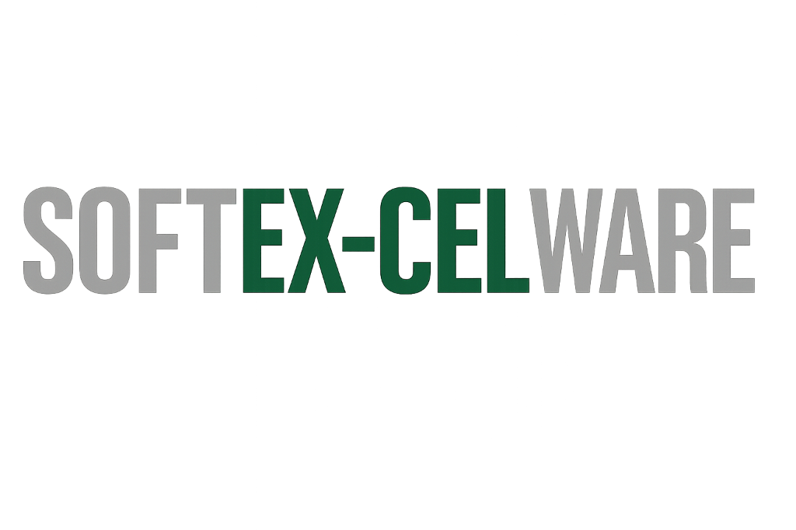

<p align="center">
  <a href="https://www.softex-celware.com/" target="_blank">
    
  </a>
</p>

<h1 align="center">素数マスター — Prime Master</h1>

<p align="center">
  60秒タイムアタック型の素数判定ゲームです。<br>
  与えられた数が素数かどうかを、60秒以内に何問正解できるか腕試ししよう！
</p>

<p align="center">
  
  
  
  
</p>

---

## 🎮 ゲーム概要

- **60秒タイムアタック** 形式で、表示された数が素数かどうかを判定します
- 難易度は **2桁 / 3桁 / 4桁** の3段階
- スコアは **正解数 − 不正解数**（ペナルティ方式）
- スコアが1以上の場合のみ、ランキングに登録できます

## 🏆 ランキング機能

| 期間 | 表示範囲 |
|---|---|
| **今日** | 直近 24 時間 |
| **今週** | 過去 7 日間（デフォルト） |
| **今月** | 過去 30 日間 |

- SQLite でサーバーに保存（難易度別・期間別で上位10件を表示）
- 30日を超えたデータは自動削除
- ⚠️ Render 無料プランではサービス再起動時にデータがリセットされる場合があります

## 🕹️ 操作方法

| 操作 | 説明 |
|---|---|
| **素数ボタン / 左矢印 / `A`キー** | 素数と判定 |
| **素数でないボタン / 右矢印 / `D`キー** | 素数でないと判定 |

## 🚀 ローカル起動

```bash
git clone https://github.com/あなたのID/prime-master.git
cd prime-master
npm install
npm start
# → http://localhost:3000
```

## ☁️ Render へのデプロイ

| 設定項目 | 値 |
|---|---|
| **Build Command** | `npm install` |
| **Start Command** | `npm start` |
| **Runtime** | `Node` |

## 🛠️ 技術スタック

- **フロントエンド**: HTML / Vanilla CSS / Vanilla JavaScript
- **バックエンド**: Node.js + Express
- **データベース**: SQLite（better-sqlite3）
- **サウンド**: Web Audio API
- **フォント**: Orbitron / Outfit（Google Fonts）
- **デプロイ**: Render

## 📁 ファイル構成

```
prime-master/
├── index.html          # メインHTML（SPA）
├── style.css           # スタイルシート
├── app.js              # フロントエンドロジック
├── server.js           # Express + SQLite バックエンド
├── package.json
├── .gitignore
└── assets/
    └── softex_celware_logo.png
```

## 📄 ライセンス

このアプリは [SOFTEX-CELWARE](https://www.softex-celware.com/) が開発しました。

---

<p align="center">
  Developed by <a href="https://www.softex-celware.com/" target="_blank"><strong>SOFTEX-CELWARE</strong></a>
</p>
